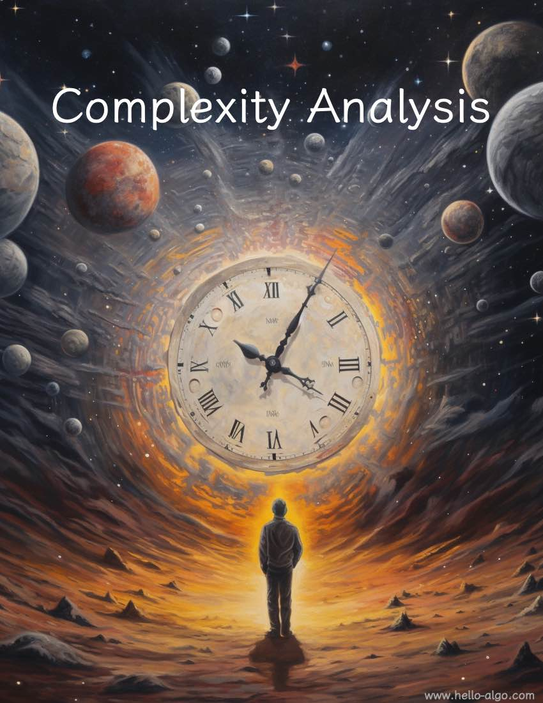

# Phân tích Độ phức tạp

!!! abstract

    Phân tích độ phức tạp giống như một hướng dẫn không-thời gian trong vũ trụ bao la của các giải thuật.

    Nó dẫn dắt chúng ta khám phá sâu trong hai chiều kích thước: thời gian và không gian, để tìm kiếm những giải pháp tinh tế hơn.
