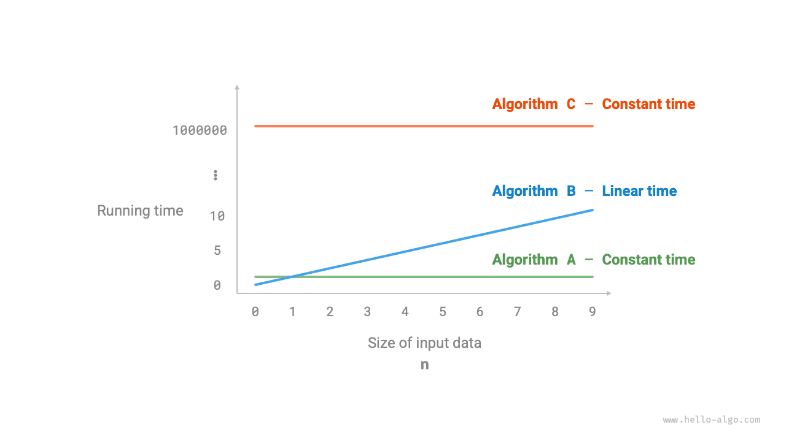

# Độ phức tạp Thời gian

Thời gian chạy có thể phản ánh trực quan và chính xác hiệu suất của một giải thuật. Nếu chúng ta muốn ước tính chính xác thời gian chạy của một đoạn code, chúng ta nên tiến hành như thế nào?

1. **Xác định nền tảng chạy**, bao gồm cấu hình phần cứng, ngôn ngữ lập trình, môi trường hệ thống, v.v., vì những yếu tố này đều ảnh hưởng đến hiệu suất thực thi code.
2. **Đánh giá thời gian chạy cần thiết cho các phép tính toán khác nhau**, ví dụ phép cộng `+` mất 1 ns, phép nhân `*` mất 10 ns, lệnh in `print()` mất 5 ns, v.v.
3. **Đếm tất cả các phép tính toán trong code**, và cộng thời gian thực thi của tất cả các phép toán để có được thời gian chạy.

Ví dụ, trong đoạn code sau, kích thước dữ liệu đầu vào là $n$:

=== "Python"

    ```python title=""
    # Trên một nền tảng chạy nhất định
    def algorithm(n: int):
        a = 2      # 1 ns
        a = a + 1  # 1 ns
        a = a * 2  # 10 ns
        # Vòng lặp n lần
        for _ in range(n):  # 1 ns
            print(0)        # 5 ns
    ```

=== "C++"

    ```cpp title=""
    // Trên một nền tảng chạy nhất định
    void algorithm(int n) {
        int a = 2;  // 1 ns
        a = a + 1;  // 1 ns
        a = a * 2;  // 10 ns
        // Vòng lặp n lần
        for (int i = 0; i < n; i++) {  // 1 ns
            cout << 0 << endl;         // 5 ns
        }
    }
    ```

=== "Java"

    ```java title=""
    // Trên một nền tảng chạy nhất định
    void algorithm(int n) {
        int a = 2;  // 1 ns
        a = a + 1;  // 1 ns
        a = a * 2;  // 10 ns
        // Vòng lặp n lần
        for (int i = 0; i < n; i++) {  // 1 ns
            System.out.println(0);     // 5 ns
        }
    }
    ```

=== "C#"

    ```csharp title=""
    // Trên một nền tảng chạy nhất định
    void Algorithm(int n) {
        int a = 2;  // 1 ns
        a = a + 1;  // 1 ns
        a = a * 2;  // 10 ns
        // Vòng lặp n lần
        for (int i = 0; i < n; i++) {  // 1 ns
            Console.WriteLine(0);      // 5 ns
        }
    }
    ```

=== "Go"

    ```go title=""
    // Trên một nền tảng chạy nhất định
    func algorithm(n int) {
        a := 2     // 1 ns
        a = a + 1  // 1 ns
        a = a * 2  // 10 ns
        // Vòng lặp n lần
        for i := 0; i < n; i++ {  // 1 ns
            fmt.Println(a)        // 5 ns
        }
    }
    ```

=== "Swift"

    ```swift title=""
    // Trên một nền tảng chạy nhất định
    func algorithm(n: Int) {
        var a = 2 // 1 ns
        a = a + 1 // 1 ns
        a = a * 2 // 10 ns
        // Vòng lặp n lần
        for _ in 0 ..< n { // 1 ns
            print(0) // 5 ns
        }
    }
    ```

=== "JS"

    ```javascript title=""
    // Trên một nền tảng chạy nhất định
    function algorithm(n) {
        var a = 2; // 1 ns
        a = a + 1; // 1 ns
        a = a * 2; // 10 ns
        // Vòng lặp n lần
        for(let i = 0; i < n; i++) { // 1 ns
            console.log(0); // 5 ns
        }
    }
    ```

=== "TS"

    ```typescript title=""
    // Trên một nền tảng chạy nhất định
    function algorithm(n: number): void {
        var a: number = 2; // 1 ns
        a = a + 1; // 1 ns
        a = a * 2; // 10 ns
        // Vòng lặp n lần
        for(let i = 0; i < n; i++) { // 1 ns
            console.log(0); // 5 ns
        }
    }
    ```

=== "Dart"

    ```dart title=""
    // Trên một nền tảng chạy nhất định
    void algorithm(int n) {
      int a = 2; // 1 ns
      a = a + 1; // 1 ns
      a = a * 2; // 10 ns
      // Vòng lặp n lần
      for (int i = 0; i < n; i++) { // 1 ns
        print(0); // 5 ns
      }
    }
    ```

=== "Rust"

    ```rust title=""
    // Trên một nền tảng chạy nhất định
    fn algorithm(n: i32) {
        let mut a = 2;      // 1 ns
        a = a + 1;          // 1 ns
        a = a * 2;          // 10 ns
        // Vòng lặp n lần
        for _ in 0..n {     // 1 ns
            println!("{}", 0);  // 5 ns
        }
    }
    ```

=== "C"

    ```c title=""
    // Trên một nền tảng chạy nhất định
    void algorithm(int n) {
        int a = 2;  // 1 ns
        a = a + 1;  // 1 ns
        a = a * 2;  // 10 ns
        // Vòng lặp n lần
        for (int i = 0; i < n; i++) {   // 1 ns
            printf("%d", 0);            // 5 ns
        }
    }
    ```

=== "Kotlin"

    ```kotlin title=""
    // Trên một nền tảng chạy nhất định
    fun algorithm(n: Int) {
        var a = 2 // 1 ns
        a = a + 1 // 1 ns
        a = a * 2 // 10 ns
        // Vòng lặp n lần
        for (i in 0..<n) {  // 1 ns
            println(0)      // 5 ns
        }
    }
    ```

=== "Ruby"

    ```ruby title=""
    # Trên một nền tảng chạy nhất định
    def algorithm(n)
        a = 2       # 1 ns
        a = a + 1   # 1 ns
        a = a * 2   # 10 ns
        # Vòng lặp n lần
        (0...n).each do # 1 ns
            puts 0      # 5 ns
        end
    end
    ```

Theo phương pháp trên, thời gian chạy của giải thuật thu được là $(6n + 12)$ ns:

$$
1 + 1 + 10 + (1 + 5) \times n = 6n + 12
$$

Tuy nhiên trong thực tế, **việc cố đếm thời gian chạy chính xác của giải thuật không thực tế cũng không khả thi**. Thứ nhất, chúng ta không muốn gắn thời gian ước tính với nền tảng chạy, vì các giải thuật cần chạy trên nhiều nền tảng khác nhau. Thứ hai, thật khó biết thời gian chạy của mỗi loại phép toán, điều này khiến quá trình ước tính trở nên cực kỳ khó khăn.

## Đếm Xu hướng Tăng trưởng Thời gian

Phân tích độ phức tạp thời gian không đếm thời gian chạy của giải thuật, **mà đếm xu hướng tăng trưởng của thời gian chạy giải thuật khi khối lượng dữ liệu tăng lên**.

Khái niệm "xu hướng tăng trưởng thời gian" khá trừu tượng; hãy hiểu nó qua một ví dụ. Giả sử kích thước dữ liệu đầu vào là $n$, và có ba giải thuật `A`, `B`, và `C`:

=== "Python"

    ```python title=""
    # Độ phức tạp thời gian của giải thuật A: bậc hằng số
    def algorithm_A(n: int):
        print(0)
    # Độ phức tạp thời gian của giải thuật B: bậc tuyến tính
    def algorithm_B(n: int):
        for _ in range(n):
            print(0)
    # Độ phức tạp thời gian của giải thuật C: bậc hằng số
    def algorithm_C(n: int):
        for _ in range(1000000):
            print(0)
    ```

=== "C++"

    ```cpp title=""
    // Độ phức tạp thời gian của giải thuật A: bậc hằng số
    void algorithm_A(int n) {
        cout << 0 << endl;
    }
    // Độ phức tạp thời gian của giải thuật B: bậc tuyến tính
    void algorithm_B(int n) {
        for (int i = 0; i < n; i++) {
            cout << 0 << endl;
        }
    }
    // Độ phức tạp thời gian của giải thuật C: bậc hằng số
    void algorithm_C(int n) {
        for (int i = 0; i < 1000000; i++) {
            cout << 0 << endl;
        }
    }
    ```

=== "Java"

    ```java title=""
    // Độ phức tạp thời gian của giải thuật A: bậc hằng số
    void algorithm_A(int n) {
        System.out.println(0);
    }
    // Độ phức tạp thời gian của giải thuật B: bậc tuyến tính
    void algorithm_B(int n) {
        for (int i = 0; i < n; i++) {
            System.out.println(0);
        }
    }
    // Độ phức tạp thời gian của giải thuật C: bậc hằng số
    void algorithm_C(int n) {
        for (int i = 0; i < 1000000; i++) {
            System.out.println(0);
        }
    }
    ```

Hình dưới đây thể hiện độ phức tạp thời gian của ba hàm giải thuật trên.

- Giải thuật `A` chỉ có $1$ phép in, và thời gian chạy của giải thuật không tăng khi $n$ tăng. Chúng ta gọi độ phức tạp thời gian của giải thuật này là "bậc hằng số".
- Trong giải thuật `B`, phép in cần lặp $n$ lần, và thời gian chạy của giải thuật tăng tuyến tính khi $n$ tăng. Độ phức tạp thời gian của giải thuật này được gọi là "bậc tuyến tính".
- Trong giải thuật `C`, phép in cần lặp $1000000$ lần. Mặc dù thời gian chạy rất dài, nhưng nó độc lập với kích thước dữ liệu đầu vào $n$. Do đó, độ phức tạp thời gian của `C` giống `A`, vẫn là "bậc hằng số".



So với việc trực tiếp đếm thời gian chạy của giải thuật, phân tích độ phức tạp thời gian có những đặc điểm gì?

- **Độ phức tạp thời gian có thể đánh giá hiệu quả hiệu suất giải thuật**. Ví dụ, thời gian chạy của giải thuật `B` tăng tuyến tính; khi $n > 1$ nó chậm hơn giải thuật `A`, và khi $n > 1000000$ nó chậm hơn giải thuật `C`. Trên thực tế, miễn là kích thước dữ liệu đầu vào $n$ đủ lớn, một giải thuật có độ phức tạp "bậc hằng số" sẽ luôn vượt trội hơn một giải thuật có độ phức tạp "bậc tuyến tính", đây chính xác là ý nghĩa của xu hướng tăng trưởng thời gian.
- **Phương pháp rút ra độ phức tạp thời gian đơn giản hơn**. Rõ ràng là cả nền tảng chạy lẫn các loại phép tính đều không liên quan đến xu hướng tăng trưởng của thời gian chạy giải thuật. Do đó, trong phân tích độ phức tạp thời gian, chúng ta có thể đơn giản coi thời gian thực thi của tất cả các phép tính là cùng một "đơn vị thời gian", giảm "theo dõi thời gian chạy của từng phép toán" thành "đếm số lượng phép toán", điều này giảm đáng kể độ khó của việc ước tính.
- **Độ phức tạp thời gian cũng có những hạn chế nhất định**. Ví dụ, mặc dù giải thuật `A` và `C` có cùng độ phức tạp thời gian, nhưng thời gian chạy thực tế của chúng khác nhau đáng kể. Tương tự, mặc dù giải thuật `B` có độ phức tạp thời gian cao hơn `C`, nhưng khi kích thước dữ liệu đầu vào $n$ nhỏ, giải thuật `B` rõ ràng vượt trội hơn giải thuật `C`. Trong những trường hợp như vậy, thường khó có thể đánh giá hiệu suất của giải thuật chỉ dựa vào độ phức tạp thời gian. Tất nhiên, mặc dù có những vấn đề trên, phân tích độ phức tạp vẫn là phương pháp hiệu quả và phổ biến nhất để đánh giá hiệu suất giải thuật.

## Cận Trên Tiệm Cận của Hàm số

Cho một hàm số với kích thước đầu vào $n$:

=== "Python"

    ```python title=""
    def algorithm(n: int):
        a = 1      # +1
        a = a + 1  # +1
        a = a * 2  # +1
        # Vòng lặp n lần
        for i in range(n):  # +1
            print(0)        # +1
    ```

=== "C++"

    ```cpp title=""
    void algorithm(int n) {
        int a = 1;  // +1
        a = a + 1;  // +1
        a = a * 2;  // +1
        // Vòng lặp n lần
        for (int i = 0; i < n; i++) { // +1 (i++ được thực thi mỗi vòng)
            cout << 0 << endl;    // +1
        }
    }
    ```

=== "Java"

    ```java title=""
    void algorithm(int n) {
        int a = 1;  // +1
        a = a + 1;  // +1
        a = a * 2;  // +1
        // Vòng lặp n lần
        for (int i = 0; i < n; i++) { // +1 (i++ được thực thi mỗi vòng)
            System.out.println(0);    // +1
        }
    }
    ```

Đặt số phép toán của giải thuật là hàm số của kích thước dữ liệu đầu vào $n$, ký hiệu là $T(n)$. Thì số phép toán của hàm trên là:

$$
T(n) = 3 + 2n
$$

$T(n)$ là hàm tuyến tính, chỉ ra rằng xu hướng tăng trưởng thời gian chạy của nó là tuyến tính, do đó độ phức tạp thời gian của nó là bậc tuyến tính.

Chúng ta ký hiệu độ phức tạp thời gian của bậc tuyến tính là $O(n)$. Ký hiệu toán học này được gọi là <u>ký hiệu big-$O$</u>, đại diện cho <u>cận trên tiệm cận</u> của hàm số $T(n)$.

Phân tích độ phức tạp thời gian về bản chất là tính toán cận trên tiệm cận của "số phép toán $T(n)$", có định nghĩa toán học rõ ràng.

!!! note "Cận trên tiệm cận của hàm số"

    Nếu tồn tại các số thực dương $c$ và $n_0$ sao cho với mọi $n > n_0$, ta có $T(n) \leq c \cdot f(n)$, thì $f(n)$ có thể được coi là cận trên tiệm cận của $T(n)$, ký hiệu là $T(n) = O(f(n))$.

Như được thể hiện trong hình dưới đây, tính toán cận trên tiệm cận là tìm một hàm $f(n)$ sao cho khi $n$ tiến đến vô cùng, $T(n)$ và $f(n)$ ở cùng mức tăng trưởng, chỉ khác nhau bởi một hệ số hằng số $c$.


## Phương pháp Rút ra

Ý tưởng về cận trên tiệm cận khá mang tính toán học. Nếu bạn cảm thấy chưa hiểu hoàn toàn, đừng lo lắng. Chúng ta có thể đầu tiên nắm vững phương pháp rút ra, và dần dần nắm bắt ý nghĩa toán học của nó thông qua việc thực hành liên tục.

Theo định nghĩa, sau khi xác định được $f(n)$, chúng ta có thể thu được độ phức tạp thời gian $O(f(n))$. Vậy làm thế nào để xác định cận trên tiệm cận $f(n)$? Nhìn chung, nó được chia thành hai bước: đầu tiên đếm số phép toán, sau đó xác định cận trên tiệm cận.

### Bước 1: Đếm số phép toán

Đối với code, hãy đếm từ trên xuống dưới theo từng dòng. Tuy nhiên, vì hệ số hằng số $c$ trong $c \cdot f(n)$ ở trên có thể có bất kỳ kích thước nào, **các hệ số và các số hạng hằng số trong số phép toán $T(n)$ đều có thể bỏ qua**. Theo nguyên tắc này, các kỹ thuật đơn giản hóa đếm sau có thể được tóm gọn.

1. **Bỏ qua các hằng số trong $T(n)$**. Vì chúng độc lập với $n$, nên chúng không ảnh hưởng đến độ phức tạp thời gian.
2. **Bỏ qua tất cả các hệ số**. Ví dụ, lặp $2n$ lần, $5n + 1$ lần, v.v., đều có thể được đơn giản hóa thành $n$ lần, vì hệ số trước $n$ không ảnh hưởng đến độ phức tạp thời gian.
3. **Sử dụng phép nhân cho các vòng lặp lồng nhau**. Tổng số phép toán bằng tích số phép toán của vòng lặp ngoài và vòng lặp trong, với mỗi lớp vòng lặp vẫn có thể áp dụng riêng kỹ thuật `1.` và `2.`.

Với một hàm cho sẵn, chúng ta có thể sử dụng các kỹ thuật trên để đếm số phép toán:

=== "Python"

    ```python title=""
    def algorithm(n: int):
        a = 1      # +0 (Kỹ thuật 1)
        a = a + n  # +0 (Kỹ thuật 1)
        # +n (Kỹ thuật 2)
        for i in range(5 * n + 1):
            print(0)
        # +n*n (Kỹ thuật 3)
        for i in range(2 * n):
            for j in range(n + 1):
                print(0)
    ```

=== "C++"

    ```cpp title=""
    void algorithm(int n) {
        int a = 1;  // +0 (Kỹ thuật 1)
        a = a + n;  // +0 (Kỹ thuật 1)
        // +n (Kỹ thuật 2)
        for (int i = 0; i < 5 * n + 1; i++) {
            cout << 0 << endl;
        }
        // +n*n (Kỹ thuật 3)
        for (int i = 0; i < 2 * n; i++) {
            for (int j = 0; j < n + 1; j++) {
                cout << 0 << endl;
            }
        }
    }
    ```

=== "Java"

    ```java title=""
    void algorithm(int n) {
        int a = 1;  // +0 (Kỹ thuật 1)
        a = a + n;  // +0 (Kỹ thuật 1)
        // +n (Kỹ thuật 2)
        for (int i = 0; i < 5 * n + 1; i++) {
            System.out.println(0);
        }
        // +n*n (Kỹ thuật 3)
        for (int i = 0; i < 2 * n; i++) {
            for (int j = 0; j < n + 1; j++) {
                System.out.println(0);
            }
        }
    }
    ```

Công thức sau cho thấy kết quả đếm trước và sau khi sử dụng các kỹ thuật trên; cả hai đều rút ra độ phức tạp thời gian là $O(n^2)$.

$$
\begin{aligned}
T(n) & = 2n(n + 1) + (5n + 1) + 2 & \text{Đếm đầy đủ (-.-|||)} \newline
& = 2n^2 + 7n + 3 \newline
T(n) & = n^2 + n & \text{Đếm đơn giản (o.O)}
\end{aligned}
$$

### Bước 2: Xác định Cận trên Tiệm cận

**Độ phức tạp thời gian được xác định bởi bậc cao nhất trong $T(n)$**. Điều này là vì khi $n$ tiến đến vô cùng, bậc cao nhất sẽ đóng vai trò chi phối, và ảnh hưởng của các số hạng khác có thể bỏ qua.

Bảng dưới đây thể hiện một số ví dụ, trong đó một số giá trị phóng đại được sử dụng để nhấn mạnh kết luận "các hệ số không thể thay đổi bậc". Khi $n$ tiến đến vô cùng, các hằng số này trở nên không đáng kể.

<p align="center"> Bảng <id> &nbsp; Độ phức tạp thời gian tương ứng với các số lượng phép toán khác nhau </p>

| Số phép toán $T(n)$ | Độ phức tạp thời gian $O(f(n))$ |
| ---------------------- | -------------------- |
| $100000$               | $O(1)$               |
| $3n + 2$               | $O(n)$               |
| $2n^2 + 3n + 2$        | $O(n^2)$             |
| $n^3 + 10000n^2$       | $O(n^3)$             |
| $2^n + 10000n^{10000}$ | $O(2^n)$             |

## Các Loại Phổ biến

Đặt kích thước dữ liệu đầu vào là $n$. Các loại độ phức tạp thời gian phổ biến được thể hiện trong hình dưới đây (sắp xếp theo thứ tự từ thấp đến cao).

$$
\begin{aligned}
& O(1) < O(\log n) < O(n) < O(n \log n) < O(n^2) < O(2^n) < O(n!) \newline
& \text{Hằng số} < \text{Logarit} < \text{Tuyến tính} < \text{Tuyến tính log} < \text{Bậc hai} < \text{Mũ} < \text{Giai thừa}
\end{aligned}
$$


### Bậc Hằng số $O(1)$

Số phép toán trong bậc hằng số độc lập với kích thước dữ liệu đầu vào $n$, nghĩa là nó không thay đổi khi $n$ thay đổi.

Trong hàm sau, mặc dù giá trị của `size` có thể lớn, nhưng nó độc lập với kích thước dữ liệu đầu vào $n$, do đó độ phức tạp thời gian vẫn là $O(1)$:

```src
[file]{time_complexity}-[class]{}-[func]{constant}
```

### Bậc Tuyến tính $O(n)$

Số phép toán trong bậc tuyến tính tăng tuyến tính so với kích thước dữ liệu đầu vào $n$. Bậc tuyến tính thường xuất hiện trong các vòng lặp đơn:

```src
[file]{time_complexity}-[class]{}-[func]{linear}
```

Các thao tác như duyệt mảng và duyệt danh sách liên kết có độ phức tạp thời gian là $O(n)$, trong đó $n$ là độ dài của mảng hoặc danh sách liên kết:

```src
[file]{time_complexity}-[class]{}-[func]{array_traversal}
```

Đáng chú ý là **kích thước dữ liệu đầu vào $n$ nên được xác định theo loại dữ liệu đầu vào**. Ví dụ, trong ví dụ đầu tiên, biến $n$ là kích thước dữ liệu đầu vào; trong ví dụ thứ hai, độ dài mảng $n$ là kích thước dữ liệu.

### Bậc Hai $O(n^2)$

Số phép toán trong bậc hai tăng theo bình phương so với kích thước dữ liệu đầu vào $n$. Bậc hai thường xuất hiện trong các vòng lặp lồng nhau, trong đó cả vòng lặp ngoài và vòng lặp trong đều có độ phức tạp thời gian là $O(n)$, dẫn đến độ phức tạp thời gian tổng thể là $O(n^2)$:

```src
[file]{time_complexity}-[class]{}-[func]{quadratic}
```

Hình dưới đây so sánh độ phức tạp thời gian bậc hằng số, bậc tuyến tính và bậc hai.


Lấy sắp xếp nổi bọt (bubble sort) làm ví dụ, vòng lặp ngoài thực thi $n - 1$ lần, và vòng lặp trong thực thi $n-1$, $n-2$, $\dots$, $2$, $1$ lần, trung bình $n / 2$ lần, dẫn đến độ phức tạp thời gian là $O((n - 1) n / 2) = O(n^2)$:

```src
[file]{time_complexity}-[class]{}-[func]{bubble_sort}
```

### Bậc Mũ $O(2^n)$

"Phân chia tế bào" trong sinh học là một ví dụ điển hình về tăng trưởng bậc mũ: trạng thái ban đầu là $1$ tế bào, sau một vòng phân chia thành $2$, sau hai vòng thành $4$, và cứ như vậy; sau $n$ vòng phân chia có $2^n$ tế bào.

Hình dưới đây và đoạn code sau mô phỏng quá trình phân chia tế bào, với độ phức tạp thời gian là $O(2^n)$. Lưu ý rằng đầu vào $n$ biểu diễn số vòng phân chia, và giá trị trả về `count` biểu diễn tổng số lần phân chia.

```src
[file]{time_complexity}-[class]{}-[func]{exponential}
```


Trong các giải thuật thực tế, bậc mũ thường xuất hiện trong các hàm đệ quy. Ví dụ, trong code sau, nó đệ quy chia đôi, dừng lại sau $n$ lần chia:

```src
[file]{time_complexity}-[class]{}-[func]{exp_recur}
```

Tăng trưởng bậc mũ rất nhanh và phổ biến trong các phương pháp vét cạn (brute force search, backtracking, v.v.). Đối với các bài toán với quy mô dữ liệu lớn, bậc mũ là không thể chấp nhận được và thường đòi hỏi quy hoạch động hoặc giải thuật tham lam để giải quyết.

### Bậc Logarit $O(\log n)$

Trái ngược với bậc mũ, bậc logarit phản ánh tình huống "giảm một nửa mỗi vòng". Đặt kích thước dữ liệu đầu vào là $n$. Vì nó giảm một nửa mỗi vòng, số vòng lặp là $\log_2 n$, đây là hàm nghịch đảo của $2^n$.

Hình dưới đây và code sau mô phỏng quá trình "giảm một nửa mỗi vòng", với độ phức tạp thời gian là $O(\log_2 n)$, viết tắt là $O(\log n)$:

```src
[file]{time_complexity}-[class]{}-[func]{logarithmic}
```


Giống như bậc mũ, bậc logarit cũng thường xuất hiện trong các hàm đệ quy. Code sau tạo thành một cây đệ quy có chiều cao $\log_2 n$:

```src
[file]{time_complexity}-[class]{}-[func]{log_recur}
```

Bậc logarit thường xuất hiện trong các giải thuật dựa trên chiến lược chia để trị, phản ánh ý tưởng chia nhỏ bài toán và đơn giản hóa nó. Nó tăng chậm và là độ phức tạp thời gian lý tưởng chỉ đứng sau bậc hằng số.

!!! tip "Cơ số của $O(\log n)$ là bao nhiêu?"

    Nói cho chính xác, "chia thành $m$ phần" tương ứng với độ phức tạp thời gian là $O(\log_m n)$. Và thông qua công thức đổi cơ số logarit, chúng ta có thể thu được các độ phức tạp thời gian với các cơ số khác nhau mà bằng nhau:

    $$
    O(\log_m n) = O(\log_k n / \log_k m) = O(\log_k n)
    $$

    Nghĩa là, cơ số $m$ có thể được chuyển đổi mà không ảnh hưởng đến độ phức tạp. Do đó, chúng ta thường bỏ qua cơ số $m$ và ký hiệu bậc logarit đơn giản là $O(\log n)$.

### Bậc Tuyến tính Logarit $O(n \log n)$

Bậc tuyến tính logarit thường xuất hiện trong các vòng lặp lồng nhau, trong đó độ phức tạp thời gian của hai lớp vòng lặp lần lượt là $O(\log n)$ và $O(n)$. Code liên quan như sau:

```src
[file]{time_complexity}-[class]{}-[func]{linear_log_recur}
```

Hình dưới đây thể hiện cách bậc tuyến tính logarit được tạo ra. Mỗi cấp độ của cây nhị phân có tổng cộng $n$ phép toán, và cây có $\log_2 n + 1$ cấp độ, dẫn đến độ phức tạp thời gian là $O(n \log n)$.


Các giải thuật sắp xếp chính thống thường có độ phức tạp thời gian là $O(n \log n)$, chẳng hạn như quicksort, merge sort và heap sort.

### Bậc Giai thừa $O(n!)$

Bậc giai thừa tương ứng với bài toán toán học "hoán vị". Cho $n$ phần tử phân biệt, tìm tất cả các cách sắp xếp có thể; số lượng cách sắp xếp là:

$$
n! = n \times (n - 1) \times (n - 2) \times \dots \times 2 \times 1
$$

Giai thừa thường được triển khai bằng đệ quy. Như được thể hiện trong hình dưới đây và code sau, cấp độ đầu tiên chia thành $n$ nhánh, cấp độ thứ hai chia thành $n - 1$ nhánh, và cứ như vậy, cho đến khi cấp độ thứ $n$ thì dừng lại:

```src
[file]{time_complexity}-[class]{}-[func]{factorial_recur}
```


Lưu ý rằng vì khi $n \geq 4$ thì luôn có $n! > 2^n$, bậc giai thừa tăng nhanh hơn bậc mũ, và cũng không thể chấp nhận được cho $n$ lớn.

## Độ Phức Tạp Thời gian Xấu nhất, Tốt nhất và Trung bình

**Hiệu suất thời gian của một giải thuật thường không cố định, mà có liên quan đến phân phối của dữ liệu đầu vào**. Giả sử chúng ta nhập một mảng `nums` có độ dài $n$, trong đó `nums` bao gồm các số từ $1$ đến $n$, với mỗi số xuất hiện chỉ một lần, nhưng thứ tự phần tử được xáo trộn ngẫu nhiên. Nhiệm vụ là trả về chỉ số của phần tử $1$. Chúng ta có thể rút ra các kết luận sau.

- Khi `nums = [?, ?, ..., 1]`, tức là khi phần tử cuối cùng là $1$, cần duyệt đầy đủ mảng, **đạt độ phức tạp thời gian xấu nhất $O(n)$**.
- Khi `nums = [1, ?, ?, ...]`, tức là khi phần tử đầu tiên là $1$, dù mảng dài bao nhiêu, cũng không cần tiếp tục duyệt, **đạt độ phức tạp thời gian tốt nhất $\Omega(1)$**.

"Độ phức tạp thời gian xấu nhất" tương ứng với cận trên tiệm cận của hàm số, được ký hiệu bằng big-$O$. Tương ứng, "độ phức tạp thời gian tốt nhất" tương ứng với cận dưới tiệm cận của hàm số, được ký hiệu bằng $\Omega$:

```src
[file]{worst_best_time_complexity}-[class]{}-[func]{find_one}
```

Đáng chú ý là chúng ta hiếm khi sử dụng độ phức tạp thời gian tốt nhất trong thực tế, vì nó thường chỉ có thể đạt được với xác suất rất nhỏ và có thể gây hiểu lầm. **Độ phức tạp thời gian xấu nhất thực tế hơn vì nó cung cấp một giá trị an toàn cho hiệu suất**, cho phép chúng ta sử dụng giải thuật với sự tin tưởng.

Từ ví dụ trên, chúng ta có thể thấy rằng cả độ phức tạp thời gian xấu nhất và tốt nhất đều chỉ xảy ra trong các phân phối đầu vào đặc biệt, và có thể xảy ra với xác suất rất thấp và có thể không thực sự phản ánh hiệu suất chạy của giải thuật. Ngược lại, **độ phức tạp thời gian trung bình có thể phản ánh hiệu suất chạy của giải thuật dưới dữ liệu đầu vào ngẫu nhiên**, được ký hiệu bằng $\Theta$.

Đối với một số giải thuật, chúng ta có thể đơn giản rút ra trường hợp trung bình dưới phân phối dữ liệu ngẫu nhiên. Ví dụ, trong ví dụ trên, vì mảng đầu vào được xáo trộn, xác suất phần tử $1$ xuất hiện ở bất kỳ chỉ số nào là bằng nhau, do đó số vòng lặp trung bình của giải thuật là nửa độ dài mảng $n / 2$, cho độ phức tạp thời gian trung bình là $\Theta(n / 2) = \Theta(n)$.

Nhưng đối với các giải thuật phức tạp hơn, việc tính độ phức tạp thời gian trung bình thường khá khó, vì khó phân tích kỳ vọng toán học tổng thể dưới phân phối dữ liệu. Trong trường hợp này, chúng ta thường sử dụng độ phức tạp thời gian xấu nhất làm tiêu chí đánh giá hiệu suất giải thuật.

!!! question "Tại sao ký hiệu $\Theta$ hiếm khi được thấy?"

    Điều này có thể vì ký hiệu $O$ quá phổ biến, vì vậy chúng ta thường sử dụng nó để biểu diễn độ phức tạp thời gian trung bình. Nhưng nói một cách nghiêm ngặt, cách thực hành này không chuẩn. Trong cuốn sách này và các tài liệu khác, nếu bạn gặp các biểu thức như "độ phức tạp thời gian trung bình $O(n)$", hãy hiểu trực tiếp nó là $\Theta(n)$.
