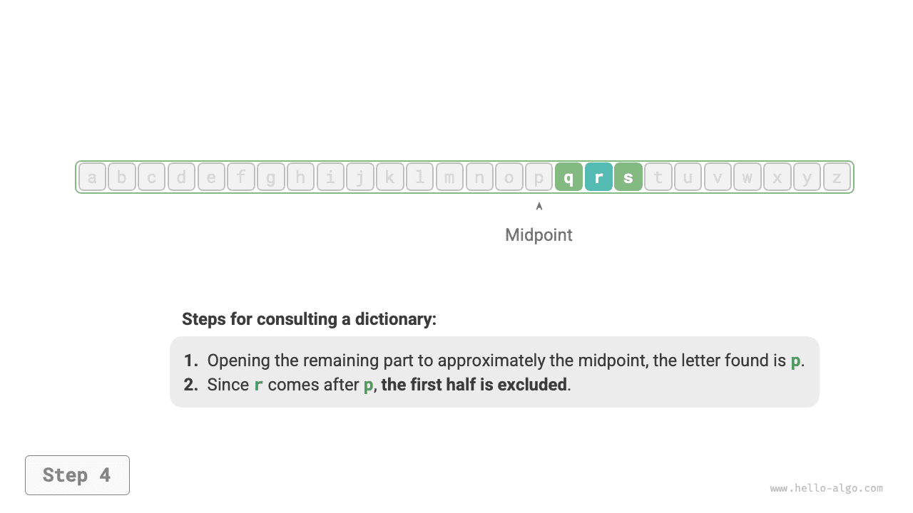
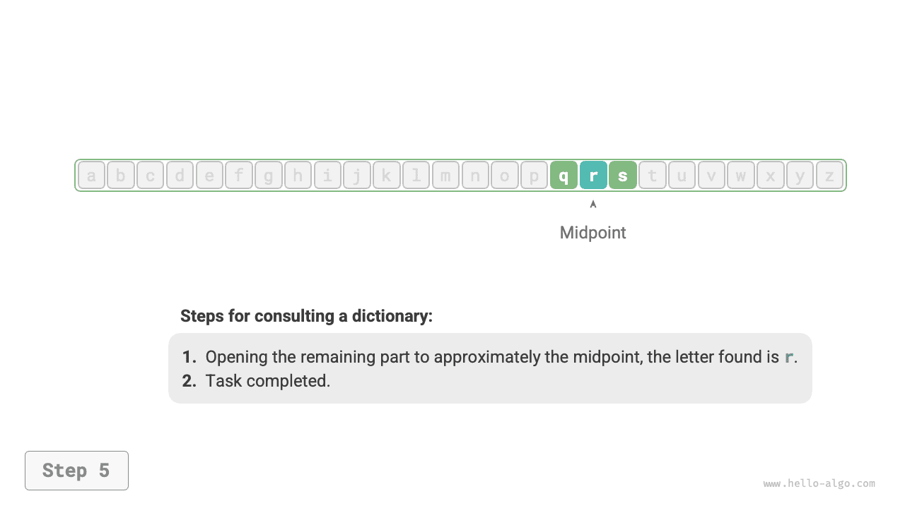

# Giải thuật ở khắp mọi nơi

Khi nghe đến thuật ngữ "giải thuật" (thuật toán), chúng ta thường nghĩ ngay đến toán học. Tuy nhiên, nhiều thuật toán không liên quan đến toán học phức tạp mà dựa nhiều hơn vào logic cơ bản, điều có thể thấy ở khắp mọi nơi trong cuộc sống hàng ngày của chúng ta.

Trước khi chúng ta chính thức khám phá các thuật toán, có một sự thật thú vị rất đáng để chia sẻ: **bạn đã học nhiều thuật toán mà không hề nhận ra, và bạn đã quen áp dụng chúng trong cuộc sống hàng ngày**. Hãy để tôi đưa ra một vài ví dụ cụ thể để minh họa cho quan điểm này.

**Ví dụ 1: Tra cứu từ điển**. Trong một cuốn từ điển tiếng Anh, các từ được liệt kê theo thứ tự bảng chữ cái. Giả sử chúng ta đang tìm kiếm một từ bắt đầu bằng chữ cái $r$, việc này thường được thực hiện theo cách sau:

1. Mở cuốn từ điển ra khoảng một nửa và kiểm tra từ đầu tiên trên trang đó; giả sử từ đó bắt đầu bằng chữ cái $m$.
2. Vì chữ cái $r$ đứng sau $m$ trong bảng chữ cái, nửa đầu cuốn từ điển có thể được bỏ qua và phạm vi tìm kiếm được thu hẹp lại trong nửa sau.
3. Lặp lại bước `1.` và `2.` cho đến khi bạn tìm thấy trang có từ bắt đầu bằng chữ $r$.

=== "<1>"
    

=== "<2>"
    

=== "<3>"
    

=== "<4>"
    

=== "<5>"
    

Tra cứu từ điển, một kỹ năng thiết yếu đối với học sinh tiểu học, thực chất chính là thuật toán "Tìm kiếm nhị phân" (Binary Search) nổi tiếng. Dưới góc độ cấu trúc dữ liệu, chúng ta có thể coi cuốn từ điển là một "mảng" (array) đã được sắp xếp; dưới góc độ thuật toán, chuỗi hành động được thực hiện để tra cứu một từ trong từ điển có thể được coi là thuật toán "Tìm kiếm nhị phân".

**Ví dụ 2: Sắp xếp các quân bài**. Khi chơi bài, chúng ta cần sắp xếp các quân bài trên tay theo thứ tự tăng dần, như được thể hiện trong quy trình sau đây.

1. Chia các quân bài thành hai phần: phần "đã sắp xếp" và phần "chưa sắp xếp", giả sử ban đầu quân bài ngoài cùng bên trái đã được sắp xếp sẵn.
2. Rút một quân bài từ phần chưa sắp xếp và chèn nó vào đúng vị trí trong phần đã sắp xếp; sau bước này, hai quân bài ngoài cùng bên trái đã được sắp xếp đúng thứ tự.
3. Lặp lại bước `2` cho đến khi tất cả các quân bài được sắp xếp đúng thứ tự.

Phương pháp sắp xếp quân bài ở trên về bản chất chính là thuật toán "Sắp xếp chèn" (Insertion Sort), một thuật toán rất hiệu quả cho các tập dữ liệu nhỏ. Nhiều triển khai sắp xếp được tích hợp sẵn trong các ngôn ngữ lập trình thường sử dụng sắp xếp chèn ở bên dưới.

**Ví dụ 3: Đổi tiền thối (Trả lại tiền thừa)**. Giả sử bạn mua hàng hết $69$ đồng tại một siêu thị. Nếu bạn đưa cho nhân viên thu ngân tờ tiền mệnh giá $100$ đồng, họ sẽ cần trả lại cho bạn $31$ đồng tiền thừa. Quy trình này có thể được hiểu rõ ràng qua hình minh họa bên dưới.

1. Các mệnh giá tiền thừa có sẵn nhỏ hơn $31$ là $1$, $5$, $10$, và $20$.
2. Lấy ra tờ tiền mệnh giá lớn nhất có thể là $20$, phần tiền thừa còn lại cần thối là $31 - 20 = 11$.
3. Lấy ra tờ tiền mệnh giá lớn nhất có thể từ các lựa chọn còn lại là $10$, phần tiền thừa còn lại là $11 - 10 = 1$.
4. Lấy ra tờ tiền mệnh giá lớn nhất có thể từ các lựa chọn còn lại là $1$, phần tiền thừa còn lại là $1 - 1 = 0$.
5. Hoàn thành việc thối tiền, giải pháp là $20 + 10 + 1 = 31$.

Trong các bước trên, chúng ta chọn phương án có vẻ là tốt nhất ở mỗi bước bằng cách sử dụng mệnh giá lớn nhất hiện có, dẫn đến một cách hiệu quả để thối tiền thừa. Dưới góc độ cấu trúc dữ liệu và giải thuật, cách tiếp cận này được gọi là thuật toán "Tham lam" (Greedy).

Từ việc nấu một bữa ăn cho đến du hành giữa các vì sao, hầu như mọi hoạt động giải quyết vấn đề đều liên quan đến giải thuật. Sự ra đời của máy tính cho phép chúng ta lưu trữ cấu trúc dữ liệu trong bộ nhớ và viết mã để gọi CPU và GPU thực thi thuật toán. Bằng cách này, chúng ta có thể chuyển các bài toán thực tế sang máy tính và giải quyết các vấn đề phức tạp khác nhau theo cách hiệu quả hơn nhiều.

!!! tip

    Nếu các khái niệm như cấu trúc dữ liệu, giải thuật, mảng và tìm kiếm nhị phân vẫn còn mơ hồ đối với bạn, hãy tiếp tục đọc. Cuốn sách này sẽ dẫn dắt bạn bước vào thế giới kỳ diệu của cấu trúc dữ liệu và giải thuật.
