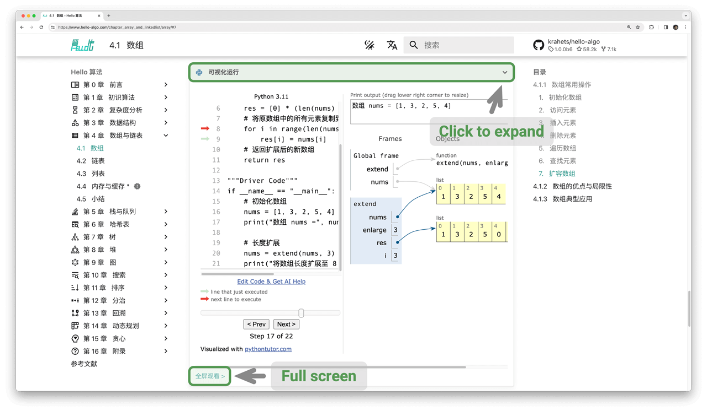

# Cách sử dụng cuốn sách này

!!! tip

    Để có trải nghiệm đọc tốt nhất, bạn nên đọc qua phần này.

## Quy ước phong cách viết

- Các phần được đánh dấu bằng ký hiệu `*` sau tiêu đề là phần không bắt buộc và có phần thử thách hơn. Nếu bạn không có nhiều thời gian, bạn có thể tạm thời bỏ qua chúng trong lần đọc đầu tiên.
- Các thuật ngữ kỹ thuật được hiển thị dưới dạng in đậm (trong bản in giấy và bản PDF) hoặc được gạch chân (trong bản web), ví dụ: <u>mảng (array)</u>. Những thuật ngữ này rất đáng nhớ vì chúng sẽ giúp bạn khi đọc các tài liệu kỹ thuật.
- Các nội dung chính và các câu tóm tắt sẽ được **in đậm**, và những phần văn bản như vậy xứng đáng được chú ý đặc biệt.
- Các từ và cụm từ có nghĩa cụ thể sẽ được đánh dấu bằng "dấu ngoặc kép" để tránh mơ hồ.
- Khi các thuật ngữ khác nhau giữa các ngôn ngữ lập trình, cuốn sách này tuân theo các quy ước của Python; ví dụ, nó sử dụng `None` để đại diện cho giá trị "null".
- Cuốn sách này giảm bớt một phần các quy tắc chú thích phong cách viết code thông thường của ngôn ngữ lập trình để có giao diện gọn gàng hơn. Các chú thích chủ yếu được chia thành ba loại: chú thích tiêu đề, chú thích nội dung và chú thích nhiều dòng.

=== "Python"

    ```python title=""
    """Chú thích tiêu đề, dùng để dán nhãn hàm, lớp, trường hợp kiểm thử, v.v."""

    # Chú thích nội dung, dùng để giải thích chi tiết code

    """
    Chú thích
    nhiều dòng
    """
    ```

=== "C++"

    ```cpp title=""
    /* Chú thích tiêu đề, dùng để dán nhãn hàm, lớp, trường hợp kiểm thử, v.v. */

    // Chú thích nội dung, dùng để giải thích chi tiết code

    /**
     * Chú thích
     * nhiều dòng
     */
    ```

=== "Java"

    ```java title=""
    /* Chú thích tiêu đề, dùng để dán nhãn hàm, lớp, trường hợp kiểm thử, v.v. */

    // Chú thích nội dung, dùng để giải thích chi tiết code

    /**
     * Chú thích
     * nhiều dòng
     */
    ```

=== "C#"

    ```csharp title=""
    /* Chú thích tiêu đề, dùng để dán nhãn hàm, lớp, trường hợp kiểm thử, v.v. */

    // Chú thích nội dung, dùng để giải thích chi tiết code

    /**
     * Chú thích
     * nhiều dòng
     */
    ```

=== "Go"

    ```go title=""
    /* Chú thích tiêu đề, dùng để dán nhãn hàm, lớp, trường hợp kiểm thử, v.v. */

    // Chú thích nội dung, dùng để giải thích chi tiết code

    /**
     * Chú thích
     * nhiều dòng
     */
    ```

=== "Swift"

    ```swift title=""
    /* Chú thích tiêu đề, dùng để dán nhãn hàm, lớp, trường hợp kiểm thử, v.v. */

    // Chú thích nội dung, dùng để giải thích chi tiết code

    /**
     * Chú thích
     * nhiều dòng
     */
    ```

=== "JS"

    ```javascript title=""
    /* Chú thích tiêu đề, dùng để dán nhãn hàm, lớp, trường hợp kiểm thử, v.v. */

    // Chú thích nội dung, dùng để giải thích chi tiết code

    /**
     * Chú thích
     * nhiều dòng
     */
    ```

=== "TS"

    ```typescript title=""
    /* Chú thích tiêu đề, dùng để dán nhãn hàm, lớp, trường hợp kiểm thử, v.v. */

    // Chú thích nội dung, dùng để giải thích chi tiết code

    /**
     * Chú thích
     * nhiều dòng
     */
    ```

=== "Dart"

    ```dart title=""
    /* Chú thích tiêu đề, dùng để dán nhãn hàm, lớp, trường hợp kiểm thử, v.v. */

    // Chú thích nội dung, dùng để giải thích chi tiết code

    /**
     * Chú thích
     * nhiều dòng
     */
    ```

=== "Rust"

    ```rust title=""
    /* Chú thích tiêu đề, dùng để dán nhãn hàm, lớp, trường hợp kiểm thử, v.v. */

    // Chú thích nội dung, dùng để giải thích chi tiết code

    // Chú thích
    // nhiều dòng
    ```

=== "C"

    ```c title=""
    /* Chú thích tiêu đề, dùng để dán nhãn hàm, lớp, trường hợp kiểm thử, v.v. */

    // Chú thích nội dung, dùng để giải thích chi tiết code

    /**
     * Chú thích
     * nhiều dòng
     */
    ```

=== "Kotlin"

    ```kotlin title=""
    /* Chú thích tiêu đề, dùng để dán nhãn hàm, lớp, trường hợp kiểm thử, v.v. */

    // Chú thích nội dung, dùng để giải thích chi tiết code

    /**
     * Chú thích
     * nhiều dòng
     */
    ```

=== "Ruby"

    ```ruby title=""
    ### Chú thích tiêu đề, dùng để dán nhãn hàm, lớp, trường hợp kiểm thử, v.v. ###

    # Chú thích nội dung, dùng để giải thích chi tiết code

    # Chú thích
    # nhiều dòng
    ```

## Học tập hiệu quả hơn với hình minh họa động

So với văn bản thuần túy, video và hình ảnh có mật độ thông tin cao hơn và cấu trúc rõ ràng hơn, giúp chúng ta dễ hiểu hơn. Trong cuốn sách này, **các khái niệm cốt lõi và các chủ đề đầy thử thách được trình bày chủ yếu thông qua các hình minh họa động**, với phần văn bản đóng vai trò là lời giải thích và bổ sung.

Nếu trong khi đọc cuốn sách này, bạn bắt gặp một hình minh họa động giống như hình dưới đây, **hãy coi hình minh họa là phần chính và văn bản là phần bổ sung**, đồng thời sử dụng cả hai cùng nhau để hiểu nội dung.


## Thấu hiểu sâu sắc hơn qua việc thực hành Code

Mã nguồn đi kèm cho cuốn sách này được lưu trữ trong [Kho lưu trữ GitHub](https://github.com/krahets/hello-algo). Như được hiển thị trong hình bên dưới, **mã nguồn đi kèm với các ca kiểm thử và có thể chạy được bằng một cú nhấp chuột**.

Nếu thời gian cho phép, **chúng tôi khuyên bạn nên tự tay gõ lại mã nguồn**. Nếu bạn có quỹ thời gian học tập hạn chế, xin ít nhất hãy đọc kỹ và chạy thử tất cả mã nguồn.

So với việc chỉ đọc code đơn thuần, tự viết code thường mang lại kết quả lớn hơn rất nhiều. **Thực hành thực tế mới là nơi việc học thực sự diễn ra**.


Việc chạy mã nguồn chủ yếu bao gồm ba bước chuẩn bị.

**Bước 1: Cài đặt môi trường lập trình cục bộ**. Vui lòng làm theo [hướng dẫn](https://www.hello-algo.com/vi/chapter_appendix/installation/) trong phụ lục. Nếu đã cài đặt sẵn, bạn có thể bỏ qua bước này.

**Bước 2: Sao chép hoặc tải xuống kho lưu trữ mã nguồn**. Truy cập [Kho lưu trữ GitHub](https://github.com/krahets/hello-algo). Nếu bạn đã cài đặt [Git](https://git-scm.com/downloads), bạn có thể sao chép kho lưu trữ này bằng lệnh sau:

```shell
git clone https://github.com/krahets/hello-algo.git
```

Ngoài ra, bạn có thể nhấp vào nút "Download ZIP" hiển thị bên dưới để tải trực tiếp tệp nén ZIP của kho lưu trữ rồi giải nén trên máy tính cục bộ của mình.


**Bước 3: Chạy mã nguồn**. Như hiển thị trong hình bên dưới, đối với các khối mã có tên tệp ở trên cùng, chúng ta có thể tìm thấy các tệp mã nguồn tương ứng trong thư mục `codes` của kho lưu trữ. Các tệp mã nguồn có thể chạy được bằng một cú nhấp chuột, điều này giúp bạn tiết kiệm thời gian gỡ lỗi không cần thiết và tập trung vào nội dung học tập.


Ngoài việc chạy code cục bộ, **phiên bản web còn hỗ trợ trực quan hóa quá trình thực thi mã nguồn Python** (được triển khai dựa trên [pythontutor](https://pythontutor.com/)). Như được hiển thị trong hình bên dưới, bạn có thể nhấp vào "Chạy trực quan" (Visual Run) bên dưới khối mã để mở rộng giao diện và quan sát quá trình thực thi mã thuật toán; bạn cũng có thể nhấp vào "Xem toàn màn hình" để có trải nghiệm xem tốt hơn.



## Cùng nhau phát triển qua việc Hỏi đáp và Thảo luận

Khi đọc cuốn sách này, vui lòng đừng bỏ qua những điểm mà bạn vẫn chưa hoàn toàn hiểu rõ. **Hãy thoải mái đặt câu hỏi của bạn trong phần bình luận**, tôi và các bạn của mình sẽ cố gắng hết sức để trả lời chúng, thường là trong vòng hai ngày.

Như được hiển thị trong hình dưới đây, phiên bản web có phần bình luận ở cuối mỗi chương. Tôi khuyến khích bạn nên chú ý theo dõi các cuộc thảo luận ở đó. Một mặt, bạn có thể tìm hiểu về những vấn đề mà người khác gặp phải, từ đó lấp đầy khoảng trống trong sự hiểu biết của chính mình và thúc đẩy tư duy sâu sắc hơn. Mặt khác, tôi hy vọng bạn sẽ hào phóng trả lời các câu hỏi của độc giả khác, chia sẻ thông tin chi tiết của mình và giúp đỡ mọi người cùng tiến bộ.


## Lộ trình Học tập Giải thuật

Nhìn chung, chúng ta có thể chia quá trình học cấu trúc dữ liệu và giải thuật thành ba giai đoạn.

1. **Giai đoạn 1: Nhập môn Giải thuật**. Chúng ta cần làm quen với các đặc điểm và cách sử dụng của các cấu trúc dữ liệu khác nhau, đồng thời tìm hiểu các nguyên lý, quy trình, công dụng và hiệu suất của các thuật toán khác nhau.
2. **Giai đoạn 2: Luyện tập các bài toán giải thuật**. Bạn nên bắt đầu với các bài toán phổ biến và giải ít nhất 100 bài trước tiên để quen thuộc với các dạng câu hỏi giải thuật chính. Khi mới bắt đầu luyện tập giải toán, việc "quên kiến thức" có thể là một thử thách lớn, nhưng hãy yên tâm, điều này rất bình thường. Chúng ta có thể ôn tập các bài toán theo "đường cong lãng quên Ebbinghaus", và sau 3-5 vòng lặp lại, chúng thường sẽ ghi sâu vào trí nhớ. Để biết danh sách câu hỏi được đề xuất và kế hoạch thực hành, vui lòng xem [kho lưu trữ GitHub này](https://github.com/krahets/LeetCode-Book).
3. **Giai đoạn 3: Xây dựng hệ thống kiến thức**. Về mặt học tập, chúng ta có thể đọc các bài viết chuyên mục giải thuật, các khung giải pháp bài toán và sách giáo khoa giải thuật để liên tục làm phong phú hệ thống kiến thức của mình. Về mặt thực hành, chúng ta có thể thử các chiến lược giải toán nâng cao, chẳng hạn như phân loại theo chủ đề, một bài toán nhiều cách giải, một cách giải cho nhiều bài toán, v.v. Các thông tin chi tiết giải quyết vấn đề liên quan có thể tìm thấy trong các cộng đồng khác nhau.

Như hiển thị trong hình bên dưới, nội dung của cuốn sách này chủ yếu bao gồm "Giai đoạn 1", nhằm mục đích giúp bạn thực hiện giai đoạn 2 và giai đoạn 3 hiệu quả hơn.


